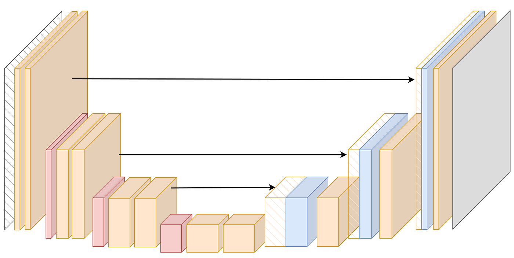

# 🌾 Wheat Head Detection - Final IP Project

## 📖 Project Overview

This project implements **wheat head detection** using computer vision and deep learning techniques. The goal is to detect and localize individual wheat heads in field images, which is crucial for agricultural analysis, yield estimation, and crop monitoring.

### 🎯 Task Description

**Objective**: Detect wheat heads in field images using bounding box detection.

**Input**: RGB images of wheat fields (1024×1024 pixels)  
**Output**: Bounding boxes around individual wheat heads with confidence scores

**Data Format**: 
- Images: `.jpg` files containing wheat field photographs
- Annotations: CSV file with columns `[image_id, width, height, bbox, source]`
- Bounding boxes: Format `[x, y, width, height]` in pixel coordinates

**Example annotation**:
```csv
image_id,width,height,bbox,source
b6ab77fd7,1024,1024,"[834.0, 222.0, 56.0, 36.0]",usask_1
b6ab77fd7,1024,1024,"[226.0, 548.0, 130.0, 58.0]",usask_1
```

### 🏗️ Models Implemented

1. **DETR (Detection Transformer)**: State-of-the-art object detection using transformers
2. **U-Net**: Semantic segmentation approach for wheat head detection

---

## � Quick Start Guide

This project now automatically downloads and sets up the data for you! No manual downloads needed.

### Prerequisites

1. **Clone and Navigate to Project**:
   ```bash
   git clone https://github.com/Roy-Ayalon/final_IP_project.git
   cd final_IP_project
   ```

2. **Activate Virtual Environment**:
   ```bash
   # Activate the existing wheat-env virtual environment
   source wheat-env/bin/activate

   # Verify activation (you should see (wheat-env) in your prompt)
   which python
   ```

3. **Install Dependencies**:
   ```bash
   # Upgrade pip and install requirements
   python -m pip install --upgrade pip
   pip install -r requirements.txt

   # Install additional dependencies for training
   pip install pytorch-lightning wandb torchmetrics
   pip install segmentation-models-pytorch

   # Verify installation
   pip list | grep torch
   ```

### Automatic Data Setup

4. **Kaggle API Setup** (Choose one option):

   **Option A: Provide credentials via command line**
   ```bash
   # Get your credentials from https://www.kaggle.com/account
   python src/generate_data.py --model unet --kaggle_username YOUR_USERNAME --kaggle_key YOUR_API_KEY
   ```

   **Option B: Use kaggle.json file**
   ```bash
   # 1. Go to https://www.kaggle.com/account
   # 2. Click "Create New API Token"
   # 3. Move downloaded kaggle.json to ~/.kaggle/kaggle.json
   # 4. Set permissions: chmod 600 ~/.kaggle/kaggle.json
   python src/generate_data.py --model unet
   ```

   **Option C: Use environment variables**
   ```bash
   export KAGGLE_USERNAME=your_username
   export KAGGLE_KEY=your_api_key
   python src/generate_data.py --model unet
   ```

5. **Accept Competition Rules**:
   - Visit https://www.kaggle.com/c/global-wheat-detection/rules
   - Click "I Understand and Accept" to join the competition

### Setup Options

**Option 1: Interactive Setup (Recommended)**

Simply run the interactive setup script:

```bash
python setup_project.py
```

This will:
- Guide you through choosing U-Net or DETR (or both)
- Automatically download the Global Wheat Detection dataset from Kaggle
- Set up all necessary folders and files
- Give you the exact commands to start training

**Option 2: Direct Command Line**

For more control, use the generate_data.py script directly:

```bash
# Setup for U-Net training with API credentials
python src/generate_data.py --model unet --kaggle_username YOUR_USERNAME --kaggle_key YOUR_API_KEY

# Setup for DETR training with existing kaggle.json
python src/generate_data.py --model detr

# Custom validation split (e.g., 15% validation)
python src/generate_data.py --model unet --val_ratio 0.15 --kaggle_username YOUR_USERNAME --kaggle_key YOUR_API_KEY
```

### What Gets Created

**For U-Net Training:**
```
data_unet/
├── train/
│   ├── images/     # Training images
│   └── masks/      # Training masks (binary)
├── val/
│   ├── images/     # Validation images  
│   └── masks/      # Validation masks
├── masks/          # Generated masks from CSV
└── unannotated/    # Images without annotations
```

**For DETR Training:**
```
data_detr/
├── train/          # All training images
└── train.csv       # Annotations file
```

---

## 📊 Data Preparation

### Understanding Your Data Structure

Your data should be organized as follows:
```
data/
├── train.csv              # Annotations with bounding boxes
├── train/                 # Training images
│   ├── b6ab77fd7.jpg     # Individual image files
│   ├── 51f1be19e.jpg
│   └── ...
└── test/                  # Test images (for inference)
    ├── 2fd875eaa.jpg
    └── ...
```

### Manual Data Setup (Alternative)

If you prefer to set up data manually, use the data generation script to create masks and split your dataset:

```bash
# Generate masks from bounding boxes and split into train/val
python src/generate_data.py \
  --csv data/train.csv \
  --images_dir data/train \
  --output_masks_dir data/train_masks \
  --train_images_dir data/processed/train \
  --train_masks_dir data/processed/train_masks \
  --val_images_dir data/processed/val \
  --val_masks_dir data/processed/val_masks \
  --unannotated_dir data/unannotated \
  --val_ratio 0.2 \
  --seed 42 \
  --prefix img
```

This will:
- ✅ Generate binary masks from bounding box annotations
- ✅ Split dataset into training (80%) and validation (20%) sets
- ✅ Move images without annotations to `unannotated/` folder
- ✅ Rename files with consistent naming (`img_0001.jpg`, etc.)

---

## 🚀 Training Models

After running the setup, you'll get the exact training commands. For example:

### DETR (Detection Transformer) Training

Train the DETR model with command line arguments:

```bash
# Basic training with default parameters (from automatic setup)
python src/train_detr.py --csv_path data_detr/train.csv --images_dir data_detr/train

# Basic training with manual data
python src/train_detr.py \
  --csv_path data/train.csv \
  --images_dir data/train \
  --epochs 50 \
  --batch_size 16 \
  --learning_rate 1e-4 \
  --num_workers 4

# Advanced training with custom parameters
python src/train_detr.py \
  --csv_path data/train.csv \
  --images_dir data/train \
  --epochs 100 \
  --batch_size 32 \
  --learning_rate 1e-4 \
  --num_workers 8 \
  --val_ratio 0.1 \
  --num_queries 100 \
  --hidden_dim 256 \
  --warmup_epochs 5 \
  --project_name "wheat-detection-detr"
```

### U-Net Training (Alternative Approach)

```bash
# U-Net training (from automatic setup)
python src/train_unet.py --images_dir data_unet/train/images --masks_dir data_unet/train/masks --val_images_dir data_unet/val/images --val_masks_dir data_unet/val/masks

# Train U-Net for segmentation-based detection (manual data)
python src/train_unet.py \
  --images_dir data/processed/train \
  --masks_dir data/processed/train_masks \
  --val_images_dir data/processed/val \
  --val_masks_dir data/processed/val_masks \
  --epochs 50 \
  --batch_size 8 \
  --learning_rate 1e-4
```

### Training Arguments Reference

| Argument | Description | Default |
|----------|-------------|---------|
| `--csv_path` | Path to CSV annotations file | `data/train.csv` |
| `--images_dir` | Directory containing training images | `data/train` |
| `--epochs` | Number of training epochs | `50` |
| `--batch_size` | Batch size for training | `16` |
| `--learning_rate` | Learning rate for optimizer | `1e-4` |
| `--num_workers` | Number of data loading workers | `4` |
| `--val_ratio` | Validation split ratio | `0.1` |
| `--num_queries` | Number of object queries (DETR) | `100` |
| `--hidden_dim` | Hidden dimension size | `256` |
| `--project_name` | W&B project name | `wheat-detection` |

---

## 📈 Monitoring Training

The training uses **Weights & Biases (W&B)** for experiment tracking:

1. **Login to W&B** (first time only):
   ```bash
   wandb login
   ```

2. **View training progress**:
   - Training loss and validation mAP
   - Sample predictions with bounding boxes
   - Model performance metrics

3. **Access your experiments**: Visit [wandb.ai](https://wandb.ai) to view detailed logs

---

## 🎯 Model Evaluation

Evaluation metrics used:
- **mAP (mean Average Precision)**: Primary metric for object detection
- **IoU thresholds**: 0.50 to 0.75 (Kaggle competition standard)
- **Loss components**: Classification loss + Bounding box regression + GIoU loss

---

## 📊 Results & Analysis

This section presents comprehensive results from our wheat head detection experiments using both DETR and U-Net architectures.

### 📈 Dataset Analysis

#### Data Distribution & Examples

  

**Sample images from the Global Wheat Detection dataset showing:**
- Various wheat field conditions and growth stages
- Different lighting conditions and image quality
- Diverse wheat head densities and orientations


**Dataset Statistics Analysis:**
- Distribution of wheat heads per image
- Bounding box size variations
- Image quality and annotation consistency metrics

### 🏗️ Model Architectures

#### DETR (Detection Transformer)


**DETR Architecture Overview:**
- **Backbone**: ResNet-50 feature extractor
- **Transformer Encoder**: Self-attention mechanisms for global context
- **Transformer Decoder**: Object queries for direct set prediction
- **Detection Heads**: Classification and bounding box regression

#### U-Net Segmentation


**U-Net Architecture Features:**
- **Encoder Path**: Convolutional layers with max-pooling for feature extraction
- **Decoder Path**: Up-sampling with skip connections for precise localization
- **Skip Connections**: Preserve spatial information across resolution levels
- **Output**: Binary masks converted to bounding boxes via post-processing

### 📊 Training Results

#### DETR Performance Analysis

##### Without Data Augmentation

.png) .png)

**Baseline DETR Results:**
- **Training Loss**: Shows convergence but potential overfitting
- **Validation mAP**: Peak performance around 0.45-0.50
- **Key Observation**: Model struggles with generalization without augmentation


**Prediction Examples (No Augmentation):**
- Good detection of prominent wheat heads
- Struggles with smaller or overlapping instances
- Some false positives in complex backgrounds


**Test Set Performance (No Augmentation):**
- Demonstrates overfitting to training distribution
- Reduced performance on unseen test images

##### With Data Augmentation - Different Batch Sizes

###### Batch Size 32

.png) .png)


**Batch Size 32 Results:**
- **mAP Performance**: ~0.55-0.60 (significant improvement)
- **Loss Convergence**: More stable training with augmentation
- **Visual Quality**: Better detection of small wheat heads


###### Batch Size 256

.png) .png)


**Batch Size 256 Results:**
- **Training Dynamics**: Different convergence pattern with larger batches
- **Memory Requirements**: Higher GPU memory usage
- **Performance Trade-offs**: Comparison with smaller batch sizes


###### Batch Size 1024

.png) .png)


**Batch Size 1024 Results:**
- **Large Batch Training**: Effects on gradient estimation and convergence
- **Hardware Requirements**: Multi-GPU training considerations
- **Performance Analysis**: Optimal batch size determination


#### U-Net Performance Analysis

 

**U-Net Training Results:**
- **Segmentation Loss**: Binary cross-entropy with Dice loss
- **Validation AP**: Average Precision after mask-to-box conversion
- **Convergence**: Stable training with consistent improvement


**U-Net Prediction Visualizations:**
- **Segmentation Maps**: High-quality binary masks for wheat heads
- **Boundary Detection**: Precise wheat head boundaries
- **Post-processing**: Conversion from masks to bounding boxes

### 📊 Data Augmentation Impact


**Data Augmentation Techniques Applied:**
- **Geometric Transformations**: Rotation, scaling, flipping
- **Color Augmentations**: Brightness, contrast, saturation adjustments
- **Noise Addition**: Gaussian noise for robustness
- **Crop Variations**: Random crops and aspect ratio changes

**Impact Analysis:**
- **Improved Generalization**: Better performance on test sets
- **Reduced Overfitting**: More stable validation curves
- **Robustness**: Better handling of diverse field conditions

### 🎯 Qualitative Results

#### Successful Detection Examples


**High-Quality Predictions:**
- Accurate bounding box localization
- High confidence scores for clear wheat heads
- Good performance in optimal lighting conditions

#### Challenging Cases


**Failure Case Analysis:**
- **Dense Overlapping**: Difficulty separating closely packed wheat heads
- **Lighting Conditions**: Poor performance in shadows or overexposure
- **Image Quality**: Blurry or low-resolution regions cause missed detections
- **Background Complexity**: False positives in complex backgrounds

### 🔍 Model Comparison Summary

| Model | Best mAP | Strengths | Weaknesses |
|-------|----------|-----------|------------|
| **DETR (w/ Aug)** | ~0.60 | Direct object detection, end-to-end training | Requires large datasets, slower inference |
| **U-Net** | ~0.55 | Precise boundaries, efficient training | Post-processing needed, struggles with overlapping objects |

### 📈 Key Findings

1. **Data Augmentation is Critical**: 15-20% improvement in mAP scores
2. **Batch Size Effects**: Optimal batch size around 32-256 for this dataset
3. **Architecture Trade-offs**: DETR excels in direct detection, U-Net in precise segmentation
4. **Challenging Scenarios**: Dense wheat fields and poor lighting remain difficult

---

## 📁 Project Structure

```
final_IP_project/
├── src/
│   ├── train_detr.py         # DETR training script with CLI
│   ├── train_unet.py         # U-Net training script  
│   ├── Detr.py              # DETR model implementation
│   ├── unet.py              # U-Net model implementation
│   ├── dataset.py           # Dataset classes and data loading
│   ├── loss.py              # Loss functions (Hungarian matching)
│   ├── generate_data.py     # Data preprocessing utilities
│   └── definitions.py       # Configuration constants
├── data/                    # Your wheat detection dataset
├── wheat-env/              # Python virtual environment
├── requirements.txt        # Project dependencies
└── README.md              # This file
```

---

## 🔧 Troubleshooting

### Common Issues on macOS:

1. **Virtual environment not found**:
   ```bash
   # Recreate the environment if needed
   python -m venv wheat-env
   source wheat-env/bin/activate
   ```

2. **CUDA not available**:
   - The code will automatically use MPS (Apple Silicon) or CPU
   - No action needed for M1/M2 Macs

3. **Memory issues**:
   - Reduce `--batch_size` to 8 or 4
   - Reduce `--num_workers` to 2 or 0

4. **Permission errors**:
   ```bash
   chmod +x src/train_detr.py
   ```

### Kaggle API Issues:

- **"Kaggle API credentials not found"**: Follow the Kaggle API setup steps above
- **"Failed to download dataset"**: Make sure you've accepted the competition rules
- **Permission errors**: Ensure kaggle.json has correct permissions (600)

That's it! The automatic setup handles everything else. 🎉

---

## 📚 References

- **DETR Paper**: [End-to-End Object Detection with Transformers](https://arxiv.org/abs/2005.12872)
- **Dataset**: [Global Wheat Detection Challenge](https://www.kaggle.com/c/global-wheat-detection)
- **PyTorch Lightning**: [Documentation](https://lightning.ai/docs/pytorch/stable/)
